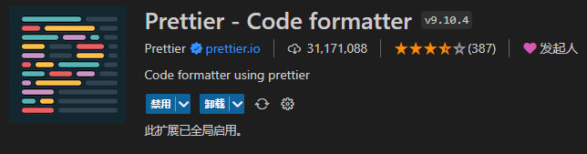

## 代码规范

### 1. 集成editorconfig配置

EditorConfig 有助于为不同 IDE 编辑器上处理同一项目的多个开发人员维护一致的编码风格。

```
# http://editorconfig.org

root = true

[*] # 表示所有文件适用
charset = utf-8 # 设置文件字符集为 utf-8
indent_style = space # 缩进风格（tab | space）
indent_size = 2 # 缩进大小
end_of_line = lf # 控制换行类型(lf | cr | crlf)
trim_trailing_whitespace = true # 去除行尾的任意空白字符
insert_final_newline = true # 始终在文件末尾插入一个新行

[*.md] # 表示仅 md 文件适用以下规则
max_line_length = off
trim_trailing_whitespace = false
```

vscode需要安装 EditorConfig for VS Code


### 2. 使用prettier工具

Prettier 是一款强大的代码格式化工具，支持 JavaScript、TypeScript、CSS、SCSS、Less、JSX、Angular、Vue、GraphQL、JSON、Markdown 等语言，基本上前端能用到的文件格式它都可以搞定，是当下最流行的代码格式化工具。

1.安装prettier

```
npm install prettier -D
```

2.配置.prettierrc文件：

- useTabs：使用tab缩进还是空格缩进，选择false；
- tabWidth：tab是空格的情况下，是几个空格，选择2个；
- printWidth：当行字符的长度，推荐80，也有人喜欢100或者120；
- singleQuote：使用单引号还是双引号，选择true，使用单引号；
- trailingComma：在多行输入的尾逗号是否添加，设置为 `none`，比如对象类型的最后一个属性后面是否加一个，；
- semi：语句末尾是否要加分号，默认值true，选择false表示不加；

```
{
  "useTabs": false,
  "tabWidth": 2,
  "printWidth": 80,
  "singleQuote": true,
  "trailingComma": "none",
  "semi": false
}
```

3.创建.prettierignore忽略文件

```
/dist/*
.local
.output.js
/node_modules/**

**/*.svg
**/*.sh

/public/*
```

4.VSCode需要安装prettier的插件



5.VSCod中的配置, 配置完后重启

- settings =>format on save => 勾选上

- settings => editor default format => 选择 prettier

  - 或者右键 >> 使用...格式化文档 >> 配置默认格式化程序

  

6.测试prettier是否生效

* 测试一：在代码中保存代码；
* 测试二：配置一次性修改的命令；

在package.json中配置一个scripts：

```
 "prettier": "prettier --write ."
```

### 3. 使用ESLint检测

1.在前面创建项目的时候，我们就选择了ESLint，所以Vue会默认帮助我们配置需要的ESLint环境。

2.VSCode需要安装ESLint插件

3.解决eslint和prettier冲突的问题：

安装插件：（vue在创建项目时，如果选择prettier，那么这两个插件会自动安装）

```
npm install eslint-plugin-prettier eslint-config-prettier -D
```

添加prettier插件：.eslintrc.cjs

```js
 extends: [
    "plugin:vue/vue3-essential",
    "eslint:recommended",
    "@vue/typescript/recommended",
    "@vue/prettier",
    "@vue/prettier/@typescript-eslint",
    'plugin:prettier/recommended'
  ],
```

4.VSCode中eslint的配置

```js
  "eslint.lintTask.enable": true,
  "eslint.alwaysShowStatus": true,
  "eslint.validate": [
    "javascript",
    "javascriptreact",
    "typescript",
    "typescriptreact"
  ],
  "editor.codeActionsOnSave": {
    "source.fixAll.eslint": true
  },
```


